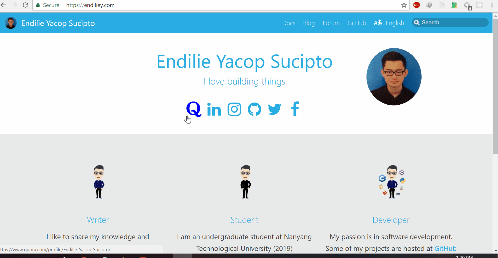

# endiliey.github.io 
[](https://travis-ci.com/endiliey/endiliey.github.io)

This is a static personal website for Endilie Yacop Sucipto



# Installation

Clone the repository
```
git clone https://github.com/endiliey/endiliey.github.io.git
```

Install dependencies
```
cd website
yarn install
```

## Running locally
It will be available on localhost:3000
```
cd website
yarn start
```
